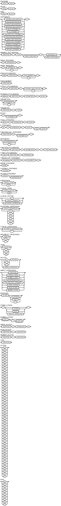

# HRL (Human-Robot Language)

HRL is a language prototype specifically designed to help developers and product owners program AI-powered systems for a wide range of applications, including chatbots, virtual assistants, and physical robots. The language is designed to be easy to learn and use, with a clean and concise syntax that allows for rapid integration and development. Programming in HRL is conceptually similar to creating a finite state machine (FSM), especially when dealing with context management and state transitions.

## Key Features

- **Easy Parallelization**: HRL provides built-in constructs for parallel execution and load balancing, allowing developers to easily distribute tasks across multiple machines or processes.

- **Pub/Sub Topics**: The language supports a publish/subscribe model for communication between different components of a system, where modules or components can publish messages (events) to specific topics and subscribe to receive messages from topics of interest.

- **Context Switching Mechanism**: Components can easily adapt to different contexts or environments by switching between different sets of rules or behaviors based on the current context or state of the system.

- **Session Management**: Built-in support is provided for managing active user sessions and maintaining state across multiple interactions. Topics can be used to store and retrieve the associated data for each session, and components can be session-aware. This includes error handling, since errors can also be isolated to not affect the entire system.

- **Setup-Loop by Default**: Programs by default run in an infinite main loop after setup, allowing for continuous execution and monitoring of the system.

- **Easy Integration**: HRL code can easily call scripts written in Python, C++ and other languages and capture their output. This makes it very easy to integrate existing models and libraries for common agent tasks (e.g., natural language processing, vision models, audio models, path planning, etc.), so you can focus on the higher-level logic.

## Example Code

```hrl
// Define context IDs
enum Context {
    General,
    Task,
    ErrorHandling
}

// Define session data structure
struct Session {
    id: String,
    context: Context,
    // Other session data
}

// Define pub/sub topics
enum Topic {
    UserInput,
    TaskCompleted,
    ErrorOccurred
}

// Context-specific behaviors
behavior generalContext(session: Session) {
    loop {
        // Listen for user input
        const userInput = waitForUserInput(session.id);

        // Publish user input to topic
        publishToTopic(Topic.UserInput, userInput);

        // Process user input based on context
        if (userInput == "start task") {
            switchContext(session, Context.Task);
        } else if (userInput == "error") {
            switchContext(session, Context.ErrorHandling);
        } else {
            respond(session.id, "Sorry, I didn't understand.");
        }
    }
}

behavior taskContext(session: Session) {
    loop {
        // Perform task-specific operations
        performTask(session.id);

        // Publish task completion to topic
        publishToTopic(Topic.TaskCompleted, session.id);

        // Listen for user input to switch context
        const userInput = waitForUserInput(session.id);
        if (userInput == "exit") {
            switchContext(session, Context.General);
        }
    }
}

behavior errorHandlingContext(session: Session) {
    loop {
        // Handle errors
        handleError(session.id);

        // Publish error to topic
        publishToTopic(Topic.ErrorOccurred, session.id);

        // Listen for user input to switch context
        const userInput = waitForUserInput(session.id);
        if (userInput == "retry") {
            switchContext(session, Context.General);
        }
    }
}

setup {
    // Start pub/sub system
    startPubSubSystem();

    // Create sessions for each chat
    const sessions = createSessions();

    // Start context-specific behaviors for each session in parallel
    for (const session in sessions) {
        threadloop generalContext(session);
        threadloop taskContext(session);
        threadloop errorHandlingContext(session);
    }
}

main {
    // Any main loop tasks here
}

```

## EBNF (Extended Backus-Naur Form) Grammar

<li>PROGRAM = SETUP, MAIN;
<li>SETUP = "setup", "{", STATEMENTS, "}";
<li>MAIN = "main", "{", STATEMENTS, "}";
<li>STATEMENTS = (VARIABLE_DECLARATION | ENUM_DECLARATION | STRUCT_DECLARATION | BEHAVIOR_DECLARATION | LOOP_STATEMENT | IF_STATEMENT | SWITCH_STATEMENT | FUNCTION_CALL_STATEMENT | CONST_DECLARATION | THREADLOOP_STATEMENT), ";";
<li>VARIABLE_DECLARATION = ("const" | λ), IDENTIFIER, ":", TYPE, "=", EXPRESSION;
<li>ENUM_DECLARATION = "enum", IDENTIFIER, "{", ENUM_MEMBER, { ",", ENUM_MEMBER }, "}";
<li>ENUM_MEMBER = IDENTIFIER;
<li>STRUCT_DECLARATION = "struct", IDENTIFIER, "{", VARIABLE_DECLARATION, { ",", VARIABLE_DECLARATION }, "}";
<li>BEHAVIOR_DECLARATION = "behavior", IDENTIFIER, "(", PARAMETERS, ")", BLOCK;
<li>PARAMETERS = (PARAMETER, { ",", PARAMETER });
<li>PARAMETER = IDENTIFIER, ":", TYPE;
<li>BLOCK = "{", STATEMENTS, "}";
<li>LOOP_STATEMENT = "loop", BLOCK;
<li>IF_STATEMENT = "if", "(", EXPRESSION, ")", BLOCK, ("else", BLOCK)?;
<li>SWITCH_STATEMENT = "switch", EXPRESSION, "{", CASE_BLOCK, "}";
<li>CASE_BLOCK = "case", EXPRESSION, ":", STATEMENTS;
<li>FUNCTION_CALL_STATEMENT = IDENTIFIER, "(", ARGUMENTS, ")";
<li>ARGUMENTS = EXPRESSION, { ",", EXPRESSION };
<li>CONST_DECLARATION = "const", IDENTIFIER, "=", EXPRESSION;
<li>THREADLOOP_STATEMENT = "threadloop", IDENTIFIER, "(", ARGUMENTS, ")";
<li>EXPRESSION = SIMPLE_EXPRESSION, { RELATIONAL_OPERATOR, SIMPLE_EXPRESSION };
<li>RELATIONAL_OPERATOR = "==", "!=";
<li>SIMPLE_EXPRESSION = IDENTIFIER | STRING_LITERAL | NUMBER_LITERAL | "(", EXPRESSION, ")" | <li>FUNCTION_CALL_STATEMENT | ARRAY_ACCESS;
<li>IDENTIFIER = LETTER, { LETTER | DIGIT };
<li>STRING_LITERAL = "\"", { LETTER | DIGIT | SPECIAL_CHARACTER }, "\"";
<li>NUMBER_LITERAL = DIGIT+;
<li>ARRAY_ACCESS = IDENTIFIER, "[", EXPRESSION, "]";
<li>TYPE = IDENTIFIER;
<li>IDENTIFIER = LETTER, { LETTER | DIGIT | "_" };
<li>LETTER = ("a" | ... | "z" | "A" | ... | "Z");
<li>DIGIT = ("1" | "2" | "3" | "4" | "5" | "6" | "7" | "8" | "9" | "0");

## Syntatic Diagram

Generated using DrawGrammar (https://jacquev6.github.io/DrawGrammar/)

